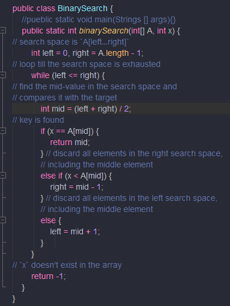
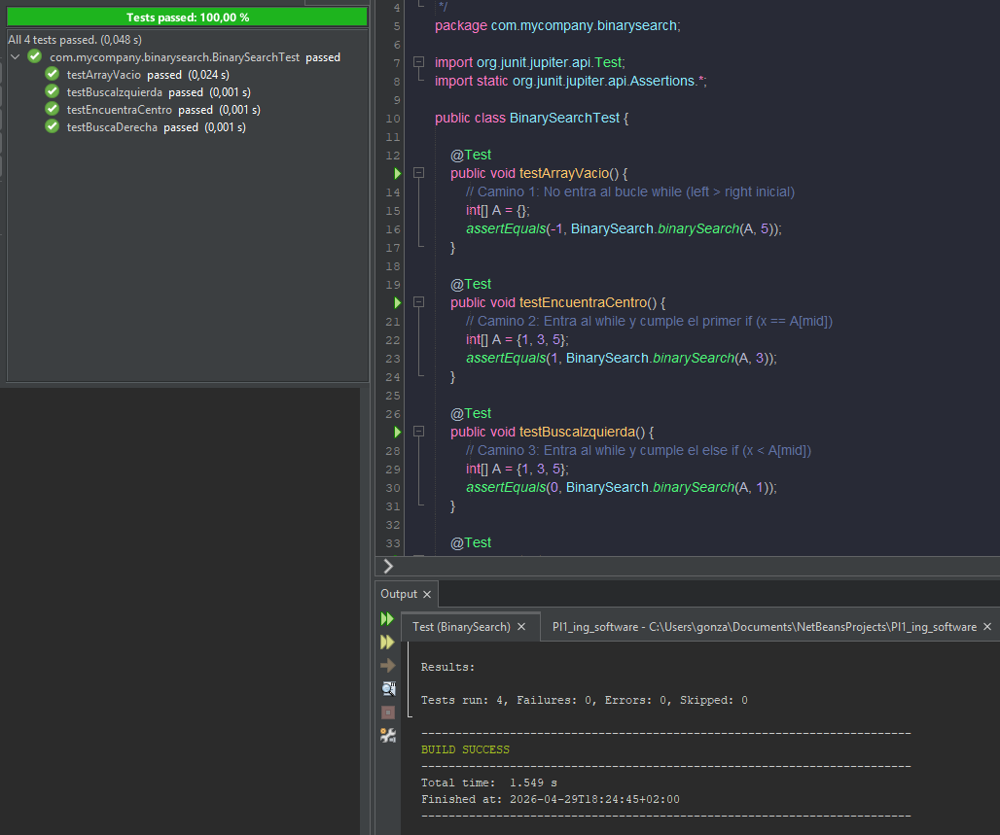
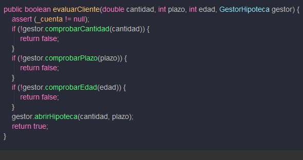
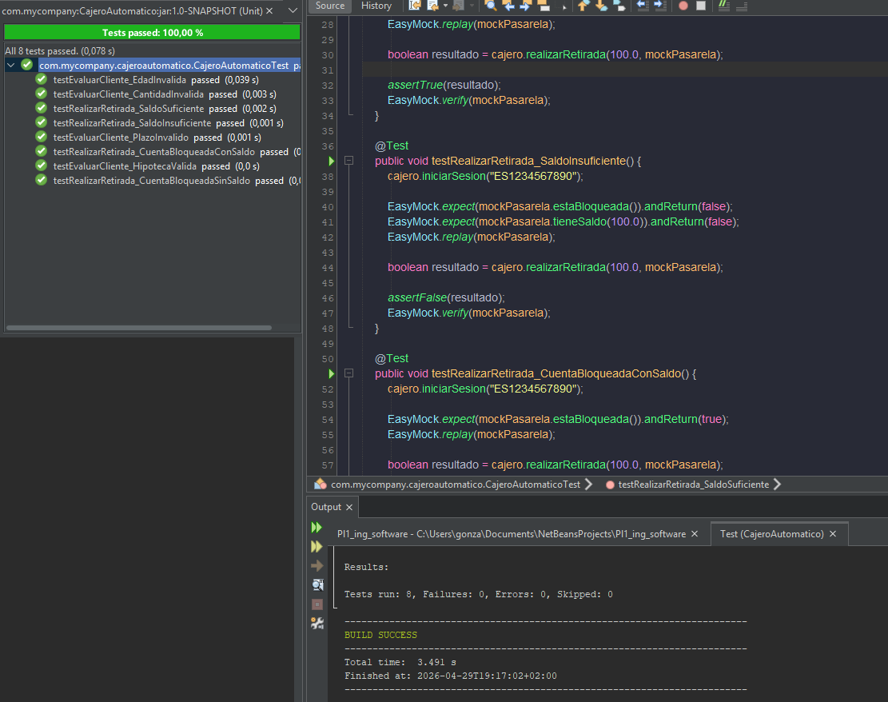

# UNIVERSIDAD DE ALCALÁ
## Grado en Ingeniería en Sistemas de Información (GISI)
### Ingeniería del Software - Curso 2025/2026

   

# PECL 2: Laboratorio
### Pruebas de Software y Análisis de Métricas

  

**Autores**
* Gonzalo Rodríguez Castro
* David Salgado Soltero

  

**Fecha:** 06/05/2026

---

# Índice
1. [Ejercicio 1: Diseño de las pruebas para el método binarySearch](#ejercicio-1)
   - 1.1 Complejidad Ciclomática
   - 1.2 Tabla de casos de prueba
2. [Ejercicio 2: Diseño de los casos de prueba para el método evaluarCliente](#ejercicio-2)
   - 2.1 Tabla de clases de equivalencia y valores límite
3. [Ejercicio 3: Análisis de métricas de JChecs](#ejercicio-3)
   - 3.1 Análisis con JavaNCSS y CKJM
   - 3.2 Valoración de mantenimiento

---

## Ejercicio 1
### <u>Complejidad Ciclómatica</u>

Para el método binarySearch, la complejidad la calculamos contando las decisiones:

<u>Decisiones:</u> 1 while, 1 if, 1 Else if = 1 + 1 + 1 = 3

<u>Fórmula:</u> nº decisiones + 1 = 4.

Cómo el resultado de la fórmula de la complejidad ciclomática es 4 sabesmos que al menos necesitamos al menos 4 cassos de prueba para poder cubrir todos los caminos independientes.

### <u>Tabla de casos de prueba</u>

| ID | Valor X | Array A | Resultado esperado |
-----|----------|---------|-------------------|
| CP1| 5 | {} | -1 |
| CP2| 3 | {1,3,5}|1|
| CP3| 1 | {1,3,5}|0|
| CP4| 5 | {1,3,5}|2|

## Ejercicio 2

Para este ejercicio utilizamos la técnica de Clases de equivalencia y valores límite sobre el método dentro de cajero automático.

### <u>Tabla de clases de equivalencia</u>

| Parámetro | Clase válida | Clases inválidas |
--------|--------|----------|
| Cantidad | 0<= x <= 200.000 | x > 200.000|
| Plazo | 0<= x <= 240 | x > 240 |
| Edad | x <= 50 | x > 50 |

Sabemos que los parametros que tenemos que testear son 3 y tienen una opción válida y una inválida, entoces para calcular la cantidad de pruebas que tenemos que realizar podríamos calcularla de tal forma 2^3 = 8 TEST.

## Ejercicio 3

### 3.1 Análisis con JavaNCSS y CKJM

Para este ejercicio hemos analizado las métricas de mantenimiento del proyecto jChecs usando las herramientas JavaNCSS y CKJM, que son las que se indican en la práctica de mantenimiento. Hemos usado JavaNCSS para analizar el código fuente, sobre todo los métodos, y CKJM lo hemos usado para analizar las clases compiladas del proyecto.

Con JavaNCSS hemos revisado principalmente las métricas NCSS y CCN. NCSS indica el tamaño del método sin contar comentarios, mientras que CCN representa la complejidad ciclomática. Esta última es importante porque cuanto mayor es, más caminos posibles tiene el método y más difícil puede ser probarlo o modificarlo sin cometer errores.

En los resultados obtenidos con JavaNCSS, los métodos que más destacan son los siguientes:

| Método | NCSS | CCN |
|---|---:|---:|
| `fr.free.jchecs.core.ArrayBoard.isAttacked(Square, boolean)` | 97 | 92 |
| `fr.free.jchecs.core.MailboxBoard.isAttacked(Square, boolean)` | 114 | 82 |
| `fr.free.jchecs.core.X88Board.isAttacked(Square, boolean)` | 100 | 82 |
| `fr.free.jchecs.ai.MobilityHeuristic.evaluate(MoveGenerator, boolean)` | 131 | 47 |
| `fr.free.jchecs.core.PGNUtils.toGame(BufferedReader)` | 86 | 42 |
| `fr.free.jchecs.core.SANUtils.toMove(MoveGenerator, String)` | 71 | 37 |
| `fr.free.jchecs.core.MailboxBoard.derive(Move, boolean)` | 112 | 36 |
| `fr.free.jchecs.core.X88Board.derive(Move, boolean)` | 118 | 36 |

Los tres métodos con mayor CCN son `isAttacked` en las clases `ArrayBoard`, `MailboxBoard` y `X88Board`. Esto tiene sentido porque comprobar si una casilla está atacada en un juego de ajedrez puede requerir muchas condiciones, ya que hay que tener en cuenta distintos tipos de piezas y movimientos. Aun así, valores como 92 y 82 son bastante altos, por lo que estos métodos pueden ser difíciles de mantener.

También destacan métodos como `MobilityHeuristic.evaluate`, `PGNUtils.toGame` y `SANUtils.toMove`. Estos métodos tienen una complejidad menor que los anteriores, pero siguen teniendo valores altos. En estos casos, el problema principal es que concentran bastante lógica dentro del mismo método, por lo que deberíamos hacer cualquier cambio con cuidado.

Con CKJM hemos revisado métricas orientadas a objetos. Las que más hemos tenido en cuenta son:

- WMC: indica el peso o complejidad de los métodos de una clase.
- CBO: indica el acoplamiento con otras clases.
- RFC: indica la cantidad de respuestas o llamadas que puede tener una clase.
- LCOM: indica falta de cohesión entre los métodos de la clase.

En los resultados de CKJM destacan las siguientes clases:

| Clase | WMC | CBO | RFC | LCOM |
|---|---:|---:|---:|---:|
| `fr.free.jchecs.swg.SwingUI` | 22 | 38 | 178 | 3 |
| `fr.free.jchecs.tools.OpeningsBuilderStart` | 17 | 13 | 125 | 0 |
| `fr.free.jchecs.core.Game` | 21 | 11 | 57 | 0 |
| `fr.free.jchecs.core.PGNUtils` | 6 | 17 | 59 | 0 |
| `fr.free.jchecs.ai.XBoardAdapter` | 6 | 19 | 47 | 0 |
| `fr.free.jchecs.core.MoveGenerator` | 15 | 3 | 15 | 105 |
| `fr.free.jchecs.ai.Engine` | 14 | 3 | 14 | 91 |
| `fr.free.jchecs.core.AbstractBoard` | 23 | 3 | 51 | 65 |
| `fr.free.jchecs.swg.UI` | 12 | 1 | 12 | 66 |
| `fr.free.jchecs.core.MailboxBoard` | 26 | 8 | 69 | 0 |
| `fr.free.jchecs.core.X88Board` | 26 | 8 | 69 | 0 |

La clase que más destaca es `SwingUI`, ya que tiene un CBO de 38 y un RFC de 178. Esto indica que está muy relacionada con otras clases y que tiene muchas posibles llamadas asociadas. Al ser parte de la interfaz gráfica, es normal que se comunique con muchas partes del sistema, pero también significa que puede ser más delicada de modificar.

También destaca `OpeningsBuilderStart`, con un RFC de 125 y un CBO de 13. Aunque su LCOM es 0, el valor alto de RFC indica que la clase puede tener bastantes responsabilidades o llamadas relacionadas.

La clase `Game` también es importante, porque representa una parte central del juego. Tiene WMC 21, CBO 11 y RFC 57. No tiene un valor malo de LCOM, pero al ser una clase principal del funcionamiento del programa, cualquier cambio en ella puede afectar a partes importantes.

Respecto a la cohesión, las clases más llamativas son `MoveGenerator`, con LCOM 105, `Engine`, con LCOM 91, `AbstractBoard`, con LCOM 65, y `UI`, con LCOM 66. Estos valores pueden indicar que esas clases agrupan métodos que no están demasiado relacionados entre sí o que tienen varias responsabilidades mezcladas.

### 3.2 Valoración de mantenimiento

Relacionando los resultados de JavaNCSS y CKJM, vemos que una de las zonas más delicadas del proyecto es la lógica del tablero. JavaNCSS muestra métodos muy complejos en `ArrayBoard`, `MailboxBoard` y `X88Board`, especialmente los métodos `isAttacked`. Además, CKJM también muestra que algunas de estas clases tienen valores altos de WMC y RFC, como `MailboxBoard` y `X88Board`, ambas con WMC 26 y RFC 69.

También consideramos problemática la parte relacionada con la lectura y conversión de partidas. Por ejemplo, `PGNUtils.toGame` tiene una CCN de 42, y la clase `PGNUtils` tiene CBO 17 y RFC 59. Esto indica que no solo hay métodos complejos, sino que además la clase está bastante conectada con otras partes del programa.

En la interfaz gráfica, la clase más destacada es `SwingUI`, porque tiene el valor más alto de acoplamiento y respuesta entre las clases analizadas. Esto puede complicar su mantenimiento, ya que cualquier cambio en esta clase puede tener consecuencias en muchas partes de la aplicación.

Por lo que hemos visto sabemos que, las partes de jChecs que parecen más problemáticas para el mantenimiento son la lógica del tablero, la interfaz gráfica y algunas clases de utilidad para interpretar partidas. Las métricas indican que hay métodos y clases que tienen más riesgo si se modifican. Habría que tener cuidado con métodos como `isAttacked`, `derive`, `toGame` y `toMove`, y con clases como `SwingUI`, `Game`, `MoveGenerator`, `AbstractBoard`, `ArrayBoard`, `MailboxBoard`, `X88Board` y `PGNUtils`, que son los elementos que más destacan en el análisis.